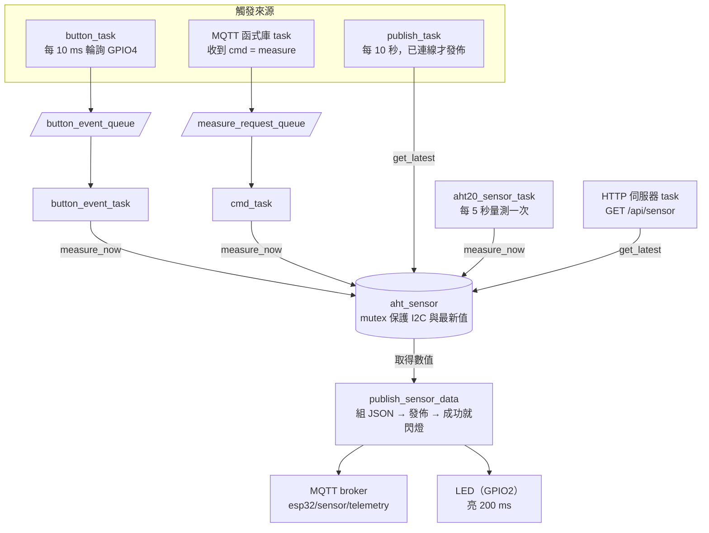
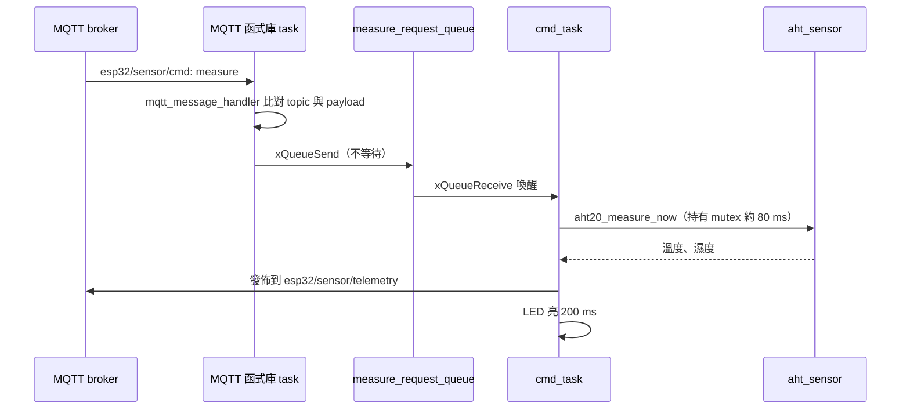

# ESP32 溫濕度感測節點

以 ESP-IDF 與 FreeRTOS 開發的 IoT 感測節點：透過 I2C 讀取 AHT20 溫濕度，經 MQTT 定期上報，並支援按鍵與 MQTT 遠端指令觸發立即量測，另提供 HTTP API 查詢最新數值。

## 功能

- **定期上報**：每 10 秒將最新溫濕度以 JSON 發佈到 MQTT
- **按鍵觸發**：按下按鍵立即重新量測並發佈
- **遠端觸發**：訂閱指令 topic，收到 `measure` 時立即重新量測並發佈
- **狀態指示**：每次 MQTT 發佈成功，LED 亮 200 ms
- **HTTP API**：`GET /api/sensor` 回傳最新溫濕度
- **斷線處理**：WiFi 斷線自動重連，MQTT 重連後自動重新訂閱

## 硬體清單

| 元件 | 數量 | 說明 |
| --- | --- | --- |
| ESP32 開發板（esp32dev） | 1 | 例如 ESP32 DevKit / DOIT DevKit V1 |
| AHT20 溫濕度模組 | 1 | I2C 介面，地址 0x38 |
| 按鍵 | 1 | 一般輕觸開關 |
| LED + 220–330 Ω 電阻 | 1 組 | 若開發板 GPIO2 已有板載 LED 可省略 |
| 麵包板、杜邦線 | 若干 | |

## 接線表

| 元件 | 元件腳位 | ESP32 腳位 | 定義位置 |
| --- | --- | --- | --- |
| AHT20 | VCC | 3V3 | — |
| AHT20 | GND | GND | — |
| AHT20 | SDA | GPIO21 | `src/aht_sensor/aht_sensor.c` |
| AHT20 | SCL | GPIO22 | `src/aht_sensor/aht_sensor.c` |
| 按鍵 | 一腳 | GPIO4 | `src/gpio_Handler/gpio_handler.c` |
| 按鍵 | 另一腳 | GND | — |
| LED | 正極（串接電阻） | GPIO2 | `src/gpio_Handler/gpio_handler.c` |
| LED | 負極 | GND | — |

接線注意事項：

- **AHT20 上拉電阻**：程式已開啟 ESP32 內部上拉，但內部上拉較弱。多數 AHT20 模組板上已有 4.7 kΩ 上拉；若為裸晶片或讀值不穩，請在 SDA、SCL 各加 4.7 kΩ 到 3.3 V。
- **按鍵**：使用內部上拉，按下時為低電位，不需外加電阻。
- **GPIO2 是開機模式腳（strapping pin）**：開機時不可被拉高。LED 串電阻接地沒有問題，但不要在 GPIO2 加上拉電阻，否則可能無法燒錄。

## 系統架構

整個系統由 5 個自行建立的 FreeRTOS task，加上 ESP-IDF 內建的事件迴圈、MQTT、HTTP 伺服器與計時器服務 task 組成。模組之間只透過三種方式溝通：queue、回呼函式、以 mutex 保護的共用資料。



### 三條發佈路徑

| 路徑 | 觸發來源 | 執行發佈的 task | 是否重新量測 |
| --- | --- | --- | --- |
| 定期 | 每 10 秒 | `publish_task` | 否，使用暫存的最新值 |
| 按鍵 | GPIO4 按下 | `button_event_task` | 是 |
| 遠端 | MQTT 收到 `measure` | `cmd_task` | 是 |

遠端指令的處理流程：



### 開機流程

1. 初始化 NVS（WiFi 驅動需要 NVS 存放校正資料）
2. 建立遠端指令 queue，並設定 MQTT 訊息回呼
3. 初始化感測器（建立 mutex、設定 I2C、啟動背景量測 task）
4. 初始化 GPIO（按鍵、LED、LED 計時器、按鍵 queue）
5. 初始化網路（建立事件迴圈、啟動 WiFi，連線在背景進行）
6. 初始化 HTTP 伺服器（登記取得 IP 事件，連上網路後才真正啟動）
7. 建立 `publish_task`、`button_event_task`、`cmd_task`

感測器與 GPIO 排在網路之前，確保網路一連上、有發佈或 HTTP 請求進來時，mutex 與計時器都已建立完成。

## 專案結構

```
src/
├── main.c                          系統初始化與三條發佈路徑
├── CMakeLists.txt                  原始碼與標頭檔路徑註冊
├── aht_sensor/
│   ├── aht_sensor.h / .c           AHT20 I2C 驅動、背景量測、mutex 保護
├── gpio_Handler/
│   ├── gpio_handler.h / .c         按鍵輪詢與去彈跳、LED 計時器
├── network/
│   ├── network_manager.h / .c      WiFi 與 MQTT 連線、訂閱、發佈
│   ├── mqtt_config.h               MQTT broker、topic 等設定
│   └── wifi_credentials.example.h  WiFi 帳密範本
└── web/
    └── web_server.h / .c           HTTP 伺服器與 /api/sensor
```

## 建置與燒錄

需要安裝 [PlatformIO](https://platformio.org/)。

1. 複製 WiFi 帳密範本並填入自己的 SSID 與密碼：

   ```
   cp src/network/wifi_credentials.example.h src/network/wifi_credentials.h
   ```

2. 視需要修改 `src/network/mqtt_config.h` 的 broker 位址與 topic。
3. 編譯、燒錄並開啟序列埠監看：

   ```
   pio run -t upload -t monitor
   ```

## 設計決策

- **模組間以 queue 解耦**：按鍵模組只負責偵測並送出事件，按下後要做什麼由 main 決定。之後改變按鍵行為不需要修改 GPIO 模組。
- **MQTT 回呼只做轉交**：回呼在 MQTT 函式庫的 task 中執行。若在其中等待約 80 ms 的量測，MQTT 在這段時間無法處理其他訊息與 broker 心跳。因此回呼只比對指令並送進 queue，實際量測交給 `cmd_task`。
- **mutex 包住整段量測流程**：「送指令 → 等 80 ms → 讀結果」必須完整執行。若只保護讀寫變數，兩個 task 同時量測時，其中一方可能讀到被打斷的資料。讀取最新值時也取得 mutex，確保溫度與濕度來自同一次量測。
- **LED 以軟體計時器熄燈**：相較於 `vTaskDelay` 後再關燈，計時器不會阻塞呼叫端；多個 task 連續觸發時，也不會出現先結束的一方提早關燈的問題。
- **網路模組不解讀指令內容**：`network_manager` 只負責收發，透過回呼把訊息交給 main。新增指令只需修改 main。
- **設定集中管理**：broker、topic、發佈間隔集中在 `mqtt_config.h`；WiFi 帳密放在不進版控的 `wifi_credentials.h`。

## 已知限制

- AHT20 未檢查狀態位元組（busy、校正位元），也未驗證 CRC
- 使用舊版 I2C API（`driver/i2c.h`），ESP-IDF 5.x 建議改用 `driver/i2c_master.h`
- 按鍵採輪詢，每 10 ms 喚醒一次
- MQTT 未使用 TLS，且預設使用公共 broker，topic 可被任何人訂閱或發佈
- `network_manager_publish` 回傳成功僅代表訊息已送出，未等待 broker 的 QoS 1 確認
- 應用程式已使用約 88% 的 1 MB app 分區

## Roadmap

- [ ] 按鍵改用 GPIO 中斷，於 ISR 中以 `xQueueSendFromISR` 送出事件
- [ ] AHT20 檢查狀態位元組並驗證 CRC-8
- [ ] I2C 改用新版 `driver/i2c_master.h`
- [ ] 低功耗：deep sleep 定時喚醒量測，按鍵作為喚醒來源，並實測平均電流
- [ ] MQTT 改用 TLS 連線
- [ ] OTA 韌體更新（需調整分區表）
- [ ] 移植至 STM32（ARM Cortex-M），驗證模組化設計的可移植性
